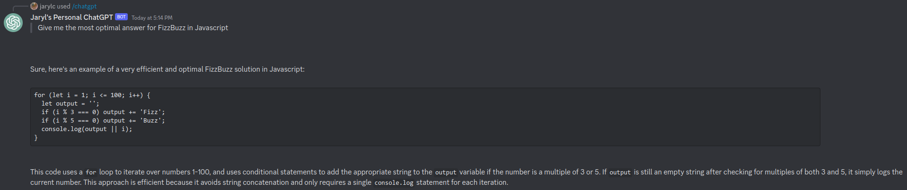

# cf-workers-chatgpt-discord-bot

## Description

Serverless Discord bot in webhook mode to quickly interface with [OpenAI's Chat Completion API](https://platform.openai.com/docs/guides/chat)

Note: This is mainly for personal use, if you would like to add features, do fork the repository. Do perform PRs back if you would be so kind!

## Prerequisites
- A Cloudflare account with Workers (at least free-tier) enabled
- Completed the [Discord Developers - Getting Started - Creating an App](https://discord.com/developers/docs/getting-started#creating-an-app) with the same scopes and have added the bot to your target server
- An OpenAI API key that has the ability to use the Chat Completion API

## Getting Started
### Wrangler
1. Clone this repository
2. Run `npm ci` or `yarn install`
3. Replace `{DISCORD_TOKEN}` and `{DISCORD_APPLICATION_ID}` in the following `DISCORD_TOKEN={DISCORD_TOKEN} DISCORD_APPLICATION_ID={DISCORD_APPLICATION_ID} npx node src/register.js` and run it to register the bot commands
4. Run `npx wrangler secret put DISCORD_APPLICATION_ID` and set the Discord app's ID
5. Run `npx wrangler secret put DISCORD_PUBLIC_KEY` and set the Discord app's public key
6. Run `npx wrangler secret put DISCORD_TOKEN` and set the Discord bot's token
7. Run `npx wrangler secret put OPENAI_API_KEY` and set the OpenAI API key
8. Add space-delimited user IDs to whitelist in `DISCORD_USERID_WHITELIST` in wrangler.toml
9. (Optional) To allow extra lines of context, run `npx wrangler kv:namespace create context` and replace the ID of `CHATGPT_DISCORD_BOT_KV` and increase `CONTEXT` to more than 0 in wrangler.toml (will consume a lot more tokens), else remove `kv_namespaces` block entirely from wrangler.toml
10. (Optional) To change the model, update `CHATGPT_MODEL` in wrangler.toml to whatever you want as documented at https://platform.openai.com/docs/api-reference/chat/create#chat/create-model
11. (Optional) To include a `system` message to set the AI's behavior, update `CHATGPT_BEHAVIOR` in wrangler.toml
12. Run `npx wrangler publish` to deploy to Cloudflare Workers
13. Set the `Interactions Endpoint URL` of your Discord application to the URL of the deployed worker
